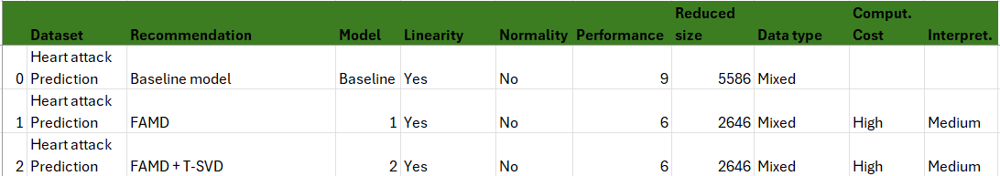
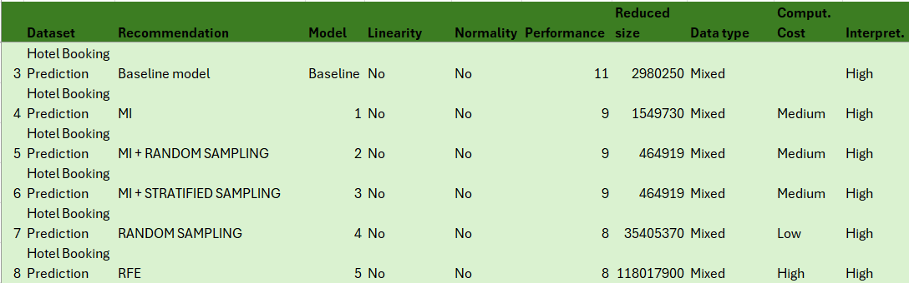
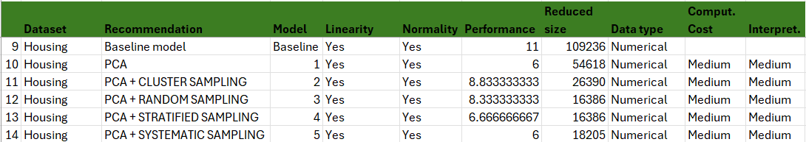
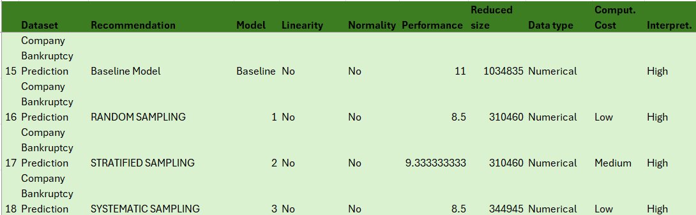
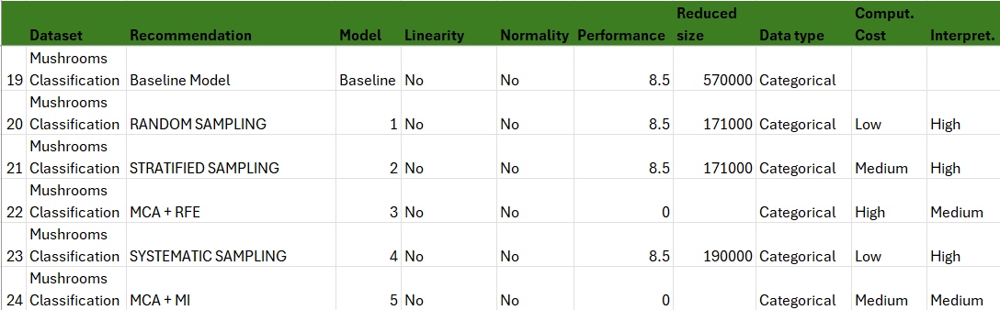
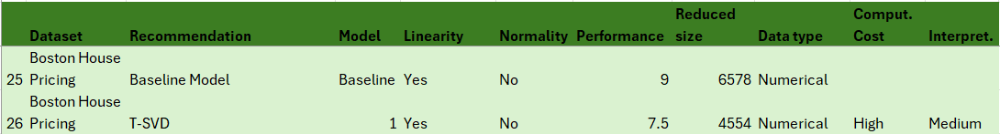
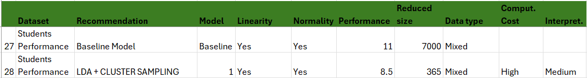

## Analysis of Results By Scenario
This file contains the analysis of the results obtained after the evaluation step by scenario.

### 1. Healthcare \& Medical Diagnostics 
Priority Order: Reduced size → Interpretability → Performance → Computational cost 
In medical contexts, datasets often involve high-dimensional patient data. Reduced size is prioritized to improve model robustness and mitigate overfitting. 
Interpretability is crucial because clinicians must understand and trust model decisions, especially in high-stakes scenarios. 
While performance is important, it’s acceptable to slightly compromise accuracy for transparency. 
Computational cost is less critical due to access to hospital infrastructure or cloud computing.

### 2. Tourism \& Hospitality Management 
Priority Order: Computational cost → Performance → Reduced size → Interpretability 
In hospitality systems (e.g., booking platforms), fast and cost-efficient decisions are essential for handling large volumes of user requests in real-time. 
Performance matters for ensuring booking accuracy and user satisfaction. 
Reduced size is secondary, useful for reducing latency. 
Interpretability is less crucial as decisions affect revenue but not human health or safety.

### 3. Sociodemographic Studies \& Public Policy 
Priority Order: Performance → Computational cost → Reduced size → Interpretability 
In policy-making, accurate prediction or classification of social phenomena is central for resource allocation and planning. 
Computational cost is considered because these studies often use large government datasets. 
Reduced size is valued to ensure feasibility on standard infrastructure. 
Interpretability is less critical as decisions are aggregated and not made at the individual level.

### 4. Finance \& Risk Management 
Priority Order: Performance → Computational cost → Reduced size → Interpretability 
Financial systems require high-performing models for forecasting, fraud detection, and risk assessment. 
Computational efficiency is vital due to the volume and velocity of financial data. 
Reduced size improves real-time applicability. 
While interpretability is helpful (e.g., for regulatory compliance), it often takes a back seat to predictive accuracy in trading and risk scenarios.

### 5. Agriculture \& Food Safety 
Priority Order: Computational cost → Performance → Reduced size → Interpretability 
In field-based applications, computational efficiency is a priority due to the use of edge devices (e.g., sensors, drones). 
Performance is key for real-time classification (e.g., plant health, mushroom edibility). 
Reduced size supports deployment on lightweight systems. 
Interpretability is useful but not mission-critical for automated decisions.

### 6. Urban Planning \& Real Estate Economics 
Priority Order: Performance → Interpretability → Reduced size → Computational cost 
Here, performance is necessary to provide reliable estimates for housing policies or economic forecasts. 
Interpretability is important to justify decisions to public officials or stakeholders. 
Reduced size supports usability across different municipalities. 
Computational cost is typically not a limiting factor, as analysis can be done offline.

### 7. Education \& Academic Analytics 
Priority Order: Reduced size → Performance → Interpretability → Computational cost 
In academic research, smaller datasets are easier to collect, share, and analyze across institutions. 
Performance ensures valid predictions of student outcomes. 
Interpretability helps explain model decisions to educators or policymakers. 
Computational cost is generally low-priority in academic settings, where time and resources are more flexible.

